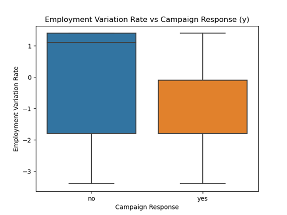
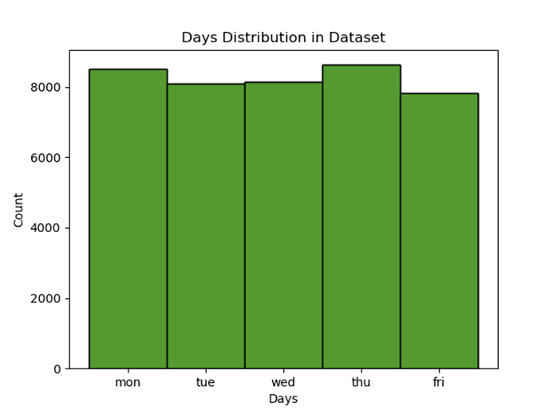

# Classification Models

## 1.  DATA LOADING & EXPLORATORY DATA ANALYSIS (EDA)
First, I started my analysis by loading the dataset into a Pandas DataFrame using the pd.read_csv() function. The dataset is called ‘bank-additional-full.csv’, and it uses a semicolon to separate values instead of a comma. 
So, I added sep=';' to correctly read the data. After importing the data, I used data.columns to check all the column names and features that are available in the dataset.
 Next, I focused on the numerical features. I used describe() function:
 

The table above shows the descriptive statistics for the numerical columns in the dataset. Here’s a basic explanation of what I observed:
Count : Each column has 41,188 rows, meaning there are no missing values in these numerical features.
Age: The average age is around 40 years. The youngest person is 17 and the oldest is 98. Most people are between 32 (25%) and 47 (75%).
Duration (length of the last contact in seconds): Mean duration is 258 seconds (~4 minutes). The duration ranges from 0 to 4918 seconds, so there are some very long calls. The 0 value might mean the person didn’t talk or call wasn’t successful.
Campaign (number of contacts during this campaign): People were contacted on average 2.56 times. Some people were contacted up to 56 times, which is very high and may affect results.
Pdays (days since client was last contacted from a previous campaign): Most values are 999, which likely means the client was not contacted before. This column has a large standard deviation because of that.
Previous (number of contacts before this campaign): On average, people were contacted 0.17 times, meaning many had no prior contact.
emp.var.rate (employment variation rate): Values range from -3.4 to 1.4, and the average is close to 0. Negative values could mean an economic downturn.
cons.price.idx (consumer price index): Values range from 92.2 to 94.76, with the average around 93.57.
cons.conf.idx (consumer confidence index): All values are negative, which could show low confidence in the economy.
euribor3m (Euro Interbank Offered Rate over 3 months): Mean value is 3.62, and it goes up to 5.04. This may affect people’s decisions on taking financial products.
nr.employed (number of employees): The average is around 5167, with a small range from 4963 to 5228. This shows little variation in this economic indicator.
To better understand the distribution of the numerical variables, I created plots for some of them. 

 

  
  

In a binned histogram for the age column, and most of the values fall into the young adult category, showing that this group makes up the largest portion of the data.

On the x-axis, we have the campaign response: "no" means the client did not subscribe. "yes" means the client did subscribe. The y-axis shows the values of euribor3m. The box shows the interquartile range (middle 50% of the data), and the line inside is the median. Clients who subscribed ("yes") generally had lower euribor3m values. The median euribor3m for those who said "yes" is much lower than for those who said "no". This may suggest that lower interest rates are associated with higher campaign success.

When nr.employed is low, it usually reflects a worse economic situation. More people agreed to the campaign offer during that time according to boxplot. It may be that employment is low, people may be more open to secure savings options like term deposits, so more of them say 'yes' to the offer. 

In the dataset, most of the ‘emp.var.rate’ values are the same, which is why we don’t clearly see a median for the ‘yes’ group. When the employment variation rate is high, people tend to say ‘no’ to the offer.

When the consumer price index (CPI) goes up, people tend to say 'no' to the campaign. But because the median of the 'no' group is very high, the overall response doesn't change much. 

In the age boxplot, the medians are close to each other, and the variations are similar. There are a few outliers.

As the duration increases, people are more likely to say 'yes' to the campaign. This suggests that longer exposure or time leads to a higher acceptance rate of the campaign.

Then, I focused on the categorical features:

The dataset has the highest number of entries for May, June, July, and August. This could indicate that these months are periods of higher activity, possibly due to seasonal trends or specific events that occur during these months, leading to more data being collected or more responses being recorded. 

The data for the days doesn't change much, and it looks similar across the different days.

People with a cellular phone are more likely to say 'yes'. This might mean that having a mobile phone makes it easier for them to join or respond to campaigns.

People with a university education have the highest rates of both 'yes' and 'no' responses. This suggests that university graduates show the most variety in their reactions, both positive and negative. After that, individuals with a high school or professional course education are more likely to say 'yes'.

Married people have the highest number of both 'yes' and 'no' responses. This means they are the largest group, and they give many answers in both directions. After married people, single people also give many responses. They are more likely to say 'yes' than others, but they also have the second highest number of 'no' responses after married people.

People who have not contacted before say 'yes' more, maybe because the campaign is new for them. People who had success before also say 'yes' often, because they had a good experience.

To examine which factors are associated with the campaign outcome, I will analyze the correlation between the independent variables and the target variable 'y_yes'.

There is a positive relationship between duration (the strongest), poutcome (success), and previous. This means that when the call duration is longer, when the previous outcome was successful, and when there was a previous contact, people are more likely to say 'yes' to the campaign. The variables 'nr.employed', 'pdays', and 'euribor3m' have the strongest negative correlations with the target variable 'y_yes'. This means that as these values increase, the likelihood of a person saying 'yes' to the campaign decreases. In other words, higher employment numbers, more days since last contact, and higher interest rates are associated with a lower chance of a positive response. 
In short, as shown in the correlation map figure, 'duration', 'previous', and 'poutcome (success)' are positively correlated with 'y_yes', meaning longer call durations, previous success, and prior contact increase the likelihood of a positive response. In contrast, 'nr.employed', 'pdays', and 'euribor3m' are negatively correlated with 'y_yes', indicating that higher values in these variables decrease the chance of a positive response.

## 2.  DATA PREPROCESSING
The initial dataset was unorganized, with all columns combined into a single column, separated by semicolons (";"). To prepare the data for analysis, I first separated the values into distinct columns. This process involved using the semicolon as a delimiter to split the data and reformat it into a more structured format.

Then, I replaced the unknown values with the mode (most frequent value) of the respective column.
I used the value_counts() function to count how many times each value appeared in the columns before and after I replaced the unknown values with the most common one (mode). This helped me see how the data changed.

After replacing the unknown values, I changed them to 'admin', 'married', and 'university degree'. The other values, like 'yes', 'no', and 'unknown', stayed as 'yes' or 'no’. This process was done to make the data more consistent and ready for analysis.
I used one-hot encoding (OHE) to convert the categorical features in the dataset into numerical values. Specifically, I applied the pd.get_dummies() function to transform all categorical columns into binary columns, where each category is represented by a separate column with 1 indicating the presence of that category and 0 indicating its absence. After applying one-hot encoding, I used .astype(int) to convert the resulting columns from float type to integers, as machine learning models typically require binary values (0 or 1).
Next, I removed certain columns from the resulting DataFrame that were no longer needed. These columns, such as default_no, housing_no, loan_no, and y_no, were generated during the one-hot encoding process and represented binary features. However, they were redundant, and I dropped them using the drop(columns=[...]) method. This step helped clean the data by eliminating unnecessary columns, leaving only the relevant features for further analysis or model training.

After this step, I separated the features (X) and the target variable (y) from the one-hot encoded data. I used ohe_data.iloc[:, 0:54] to select the first 54 columns, which contain the input data (features) that will be used to make predictions. These are the independent variables. Then, I used ohe_data.iloc[:, 54:] to select the remaining columns starting from the 54th column, which represent the target variable that we want to predict. By using .iloc, I was able to choose the specific columns based on their position in the data, where [0:54] gets the features and [54:] gets the target variable. This way, I split the data into the parts needed for training the model.

 

  
  

To deal with the imbalance in the data, I used an under-sampling technique. The target variable (y_yes) had an unequal distribution of classes, where one class was much more frequent than the other. To fix this, I split the dataset into two groups based on the values of y_yes, class 0 (no) and class 1 (yes). Then, I took a random sample of class 0 to match the number of records in class 1, which helps make the dataset more balanced. After that, I combined the two classes (the down sampled class 0 and the original class 1) into a new dataset for training and testing. This way, the model can learn from both classes more equally, avoiding bias towards the larger class.
I used the train_test_split() function to divide the data into training and testing sets, using 70% for training and 30% for testing. This helps the model learn from the balanced dataset and then test its performance on unseen data (Chachra, 2020).

The StandardScaler is used to scale or normalize the data, especially when the features have different units or magnitudes. 
Z = (X - μ) / σ
	
Where:
X: is the original value of the feature
μ: is the mean of the feature
σ:  is the standard deviation of the feature

## 3.  MODEL TRAINING
I used the RandomForestClassifier model for this task and trained it with the training data. I set a few important parameters for the model. First, I used criterion='entropy', which helps the model decide the best way to split the data in the trees. Entropy helps the model measure how mixed up the data is and aims to reduce this with each split. I also set class_weight='balanced' so that the model gives more importance to the class that appears less often, preventing it from favoring the majority class.
The min_samples_split=5 and min_samples_leaf=2 parameters tell the model how many data points are needed to split a node and how many are needed to make a leaf. These settings help the model avoid overfitting by making sure splits are only made if there are enough samples, and the leaf nodes don’t get too specific.
After setting these parameters, I trained the model using the fit() method with the training data. Then, I used predict() to make predictions on the test data. The model uses all the decision trees in the forest and takes the majority vote for the final prediction. This method helps make the model more accurate and prevents overfitting.
In summary, the RandomForestClassifier is set to deal with imbalanced data and avoid overfitting by adjusting some parameters like class weight and minimum samples for splits and leaves. It uses entropy for decision-making and combines multiple decision trees to make the model more reliable (Scikit-learn, 2023).

## 4.  MODEL EVALUATION
In this section, a Random Forest model is evaluated using several performance metrics. These include precision, recall, accuracy, F1 score, and the AUC-ROC curve. The confusion matrix is also examined to understand the distribution of predicted vs. actual values. Precision and recall give insights into the model's ability to correctly classify positive and negative cases, while the F1 score balances both precision and recall. Accuracy provides an overall measure of the model’s performance, and the AUC-ROC curve helps assess its ability to distinguish between classes at various thresholds.
Confusion Matrix of Random Forest Model:                                                                                        

|               | Predicted 0 | Predicted 1 |
|---------------|-------------|-------------|
| **Actual 0**  | 1166        | 227         |
| **Actual 1**  | 103         | 1288        |

True Negatives (TN) = 1166
The model correctly predicted 1166 instances as negative (class 0), which means it correctly identified people who did not say "yes" to the campaign. 
False Positives (FP) = 227
The model incorrectly predicted 227 instances as positive (class 1) when they were actually negative. This means the model mistakenly predicted people as likely to say "yes" when they actually did not.
False Negatives (FN) = 103
The model incorrectly predicted 103 instances as negative (class0) when they were actually positive. This means the model missed people who would have said "yes" to the campaign.
True Positives (TP) = 1288
The model correctly predicted 1288 instances as positive (class1), meaning it correctly identified people who would say "yes" to the campaign.

### Model Evaluation Metrics

| **Metric**   | **Value** | **Interpretation** |
|--------------|-----------|---------------------|
| Accuracy     | 0.8815    | The model correctly predicts 88.15% of all cases, showing good overall performance. |
| F1-Score     | 0.8864    | The model strikes a good balance between identifying positives and minimizing mistakes, indicating good overall accuracy. |
| Precision    | 0.8502    | When the model predicts a positive outcome, it's correct 85.02% of the time, meaning it makes few false positive mistakes. |
| Recall       | 0.926     | The model correctly identifies 92.6% of all actual positive cases, meaning it catches most of the positives. |

In the Precision-Recall curve, the last point is located quite high, and the AP (Average Precision) value is found to be 0.93. This indicates that the model performs very well at correctly predicting positive class instances. In other words, the model is generally good at identifying positive cases while minimizing false positives.
Additionally, the AUC (Area Under the Curve) of the ROC curve is calculated as 0.94. This demonstrates the model's ability to distinguish between both classes (positive and negative) with high accuracy. A high AUC value means that the model is very effective at differentiating between the positive and negative classes, showing strong classification performance.

## 5.  MODEL COMPARISON & INSIGHTS
In this section, we compare the performance of five different machine learning models (Random Forest, SVM, KNN, Decision Tree, and Logistic Regression) to predict whether a customer will subscribe to a bank's product, such as a term deposit. To evaluate these models, we focus on several key metrics: Accuracy, F1-Score, Precision, Recall, AUC-ROC, and the Confusion Matrix (CM).
### Confusion Matrix

#### 🟩 Random Forest

> The Random Forest model performs very well in both predicting subscriptions and non-subscriptions.  
> It has a high True Positive rate, meaning it correctly identifies most customers who subscribed,  
> while it also correctly identifies many non-subscribers.  
> The False Negative and False Positive rates are low, indicating that the model's errors are minimal.

|               | Predicted 0 | Predicted 1 |
|---------------|-------------|-------------|
| **Actual 0**  | 1166        | 227         |
| **Actual 1**  | 103         | 1288        |

#### 🟦 Support Vector Machine (SVM)

> The SVM model also performs well.  
> It has a slightly lower True Positive count than Random Forest but makes fewer False Positives (198),  
> which means it’s more conservative in predicting subscriptions.  
> However, the False Negative rate is a bit higher compared to Random Forest (154), indicating that it misses more actual subscribers.

|               | Predicted 0 | Predicted 1 |
|---------------|-------------|-------------|
| **Actual 0**  | 1195        | 198         |
| **Actual 1**  | 154         | 1237        |

#### 🟨 K-Nearest Neighbors (KNN)

> KNN has similar performance to SVM in terms of True Positives and True Negatives,  
> but it makes more False Negatives (210) and False Positives (216) than both Random Forest and SVM.  
> This suggests that KNN is less reliable when distinguishing between subscribers and non-subscribers.

|               | Predicted 0 | Predicted 1 |
|---------------|-------------|-------------|
| **Actual 0**  | 1177        | 216         |
| **Actual 1**  | 210         | 1181        |

#### 🟥 Decision Tree

> Decision Tree has a similar True Positive count to Random Forest, but its False Positives are higher (321).  
> This means that it makes more errors by predicting subscriptions when there were none.  
> However, it still has a relatively low False Negative rate (102), so it correctly identifies most actual subscribers.

|               | Predicted 0 | Predicted 1 |
|---------------|-------------|-------------|
| **Actual 0**  | 1072        | 321         |
| **Actual 1**  | 102         | 1289        |

#### ⚪ Logistic Regression

> Logistic Regression is very similar to SVM in performance.  
> It has a reasonable True Positive rate (1189) but also has more False Negatives (202),  
> meaning it misses more actual subscribers than other models like Random Forest.  
> It also has a relatively low False Positive count (209), indicating that it's conservative when predicting subscriptions.

|               | Predicted 0 | Predicted 1 |
|---------------|-------------|-------------|
| **Actual 0**  | 1184        | 209         |
| **Actual 1**  | 202         | 1189        |

### 📊 Comparison of Model Performance Metrics

| **Metric**   | **Random Forest (RF)** | **SVM** | **KNN** | **Decision Tree (DT)** | **Logistic Regression (LR)** |
|--------------|------------------------|---------|---------|-------------------------|-------------------------------|
| Accuracy     | 0.8815                 | 0.8736  | 0.8470  | 0.8481                  | 0.8570                        |
| F1-Score     | 0.8864                 | 0.8754  | 0.8472  | 0.8590                  | 0.8566                        |
| Precision    | 0.8502                 | 0.8620  | 0.8454  | 0.8006                  | 0.8585                        |
| Recall       | 0.9260                 | 0.8893  | 0.8490  | 0.9267                  | 0.8548                        |

Random Forest (RF):
Random Forest has the highest accuracy (88.15%) and F1-Score (0.8864). This suggests it is the most balanced and well-rounded model for predicting whether customers will subscribe to the bank’s product. It is good at both identifying true positives (high recall) and minimizing false positives (good precision). This model is highly reliable for detecting both the customers likely to subscribe (positive cases) and those unlikely to subscribe (negative cases). It performs best for this type of prediction.

Support Vector Machine (SVM):
SVM has the highest precision (0.862) among the models, which means it is very good at minimizing false positives. This means it is good at predicting customers who are likely to say "yes" to the bank's product without over-predicting. While the precision is good, SVM's recall (0.8893) is lower than Random Forest, meaning it might miss some true positives (customers who would actually subscribe). So, while it's good at making correct predictions when it predicts "yes," it might fail to catch some positive cases.

K-Nearest Neighbors (KNN):
KNN has the lowest accuracy (84.7%) and F1-Score (0.8472), indicating that it struggles with generalizing from the data. KNN performs poorly in this scenario, likely because it has trouble distinguishing between the positive and negative classes in a high-dimensional dataset like this one. It could be more sensitive to noise in the data, leading to errors in prediction.

Decision Tree (DT):
Decision Tree has the highest recall (92.67%), meaning it is very good at identifying positive cases (customers who will subscribe). However, its precision (0.8006) is lower, meaning it might classify some customers as likely to subscribe when they actually won’t (false positives). Decision Trees are very effective at catching most of the positive cases, but they may predict some customers as "yes" who actually will not subscribe. In a real-world scenario, this could be useful when you want to ensure you don’t miss any potential customers, even at the cost of some false positives.

Logistic Regression (LR):
Logistic Regression offers moderate performance with accuracy (85.7%) and F1-Score (0.8566), but it falls behind Random Forest and Decision Trees in both precision and recall. Logistic Regression is an easy-to-interpret model but is not the best for this dataset. While it performs reasonably well, it may miss some positive cases (lower recall) and could have slightly higher false positives than Random Forest or Decision Tree.

If we were to present this visually in a bar chart for the Bank Marketing dataset, each model could be evaluated based on its performance in relation to specific goals. Random Forest would demonstrate the highest reliability in predicting customer subscriptions, providing a well-rounded and accurate prediction. SVM would be depicted as the best option when minimizing false positives is the priority, as it is particularly effective in reducing these types of errors. Decision Tree, in contrast, would be shown as effective for capturing as many positive cases as possible, even though it may lead to a higher number of false positives. This visual summary would highlight how each model performs according to the different objectives—whether focusing on reliability, minimizing false positives, or maximizing positive case detection.

### AUC-ROC Curve

The Random Forest (Model Evaluation) model performs very well, with an AP of 0.92, indicating that it is effective at predicting positive instances (subscribers) with minimal false positives. The AUC value of 0.94 shows that the model is excellent at distinguishing between the two classes (subscribers vs. non-subscribers). This model strikes a good balance between precision and recall, making it one of the most reliable choices for predicting customer subscriptions.

SVM also performs very well, with an AP of 0.92 and an AUC of 0.94. The high AP shows that SVM is good at predicting the positive class (subscribers) while minimizing false positives, just like Random Forest. The AUC of 0.94 demonstrates that SVM can effectively separate the two classes. This makes SVM a solid option for situations where minimizing false positives is important, though it may slightly miss some positive cases.

KNN has a lower AP (0.85) compared to Random Forest and SVM, which indicates that it is not as effective at predicting the positive class without making more false positive predictions. Additionally, its AUC value of 0.90, while still good, is lower than Random Forest and SVM, meaning it doesn't distinguish between the classes as effectively as the other two models. KNN might be less reliable when the goal is to focus on the positive class.

Decision Tree has an AP of 0.88, which is better than KNN but still lower than Random Forest and SVM. This suggests it is reasonably good at identifying positive instances but might make more false positives or false negatives compared to the higher-performing models. The AUC value of 0.92 indicates that it can distinguish between the positive and negative classes well, though it's slightly less effective than Random Forest and SVM.

Logistic Regression performs similarly to SVM and Random Forest, with an AP of 0.92 and an AUC of 0.93. The AP value shows that it is effective at predicting positive instances, and the AUC value of 0.93 indicates that it can distinguish between classes quite well, though it may not be as strong as Random Forest in this regard. It's a good model for balancing precision and recall while minimizing false positives.

## 6. CONCLUSION:
In conclusion, the Random Forest model outperforms other machine learning models such as Support Vector Machine (SVM), K-Nearest Neighbors (KNN), Decision Tree (DT), and Logistic Regression (LR) in predicting customer subscriptions to a bank product. With the highest accuracy (88.15%) and F1-Score (0.8864), Random Forest strikes a good balance between precision and recall, making it the most reliable model for this task. While SVM excels in precision, minimizing false positives, it has a slightly lower recall. KNN struggles with generalization, resulting in the lowest accuracy and F1-Score. Decision Trees, though excellent at capturing true positives, suffer from lower precision, which could lead to false positives. Logistic Regression performs reasonably well but is outperformed by more complex models. Overall, Random Forest provides the best combination of reliability, accuracy, and generalization for predicting whether a customer will subscribe to a bank's campaign.

### 📂 Dataset
This project uses the [Bank Marketing Dataset](https://archive.ics.uci.edu/dataset/222/bank+marketing) from UCI.  
Citation: Moro, S., Cortez, P., & Rita, P. (2014). *Decision Support Systems*, 62, 22–31. https://doi.org/10.1016/j.dss.2014.03.001

### License and Credits

This project is mainly developed by me.

However, the undersampling part of the code is adapted from work by **Sahil Chachra (2020)**,  
licensed under the MIT License.

See the [LICENSE](License) file for full license text.

## 7. References

- Moro, S., Cortez, P., & Rita, P. (2014). *Bank Marketing Data Set*. UCI Machine Learning Repository.  
  Retrieved from [https://archive.ics.uci.edu/dataset/222/bank+marketing](https://archive.ics.uci.edu/dataset/222/bank+marketing)

- Chachra, S. (2020). *Handling Imbalanced Dataset* [Python notebook]. GitHub.  
  Retrieved from [https://github.com/SahilChachra/Handling-Imbalanced-Dataset](https://github.com/SahilChachra/Handling-Imbalanced-Dataset)

- Scikit-learn (n.d.). *StandardScaler Documentation*.  
  Retrieved from [https://scikitlearn.org/stable/modules/generated/sklearn.preprocessing.StandardScaler.html](https://scikitlearn.org/stable/modules/generated/sklearn.preprocessing.StandardScaler.html)

- Python Documentation (n.d.). *statistics.mode*.  
  Retrieved from [https://docs.python.org/3/library/statistics.html#statistics.mode](https://docs.python.org/3/library/statistics.html#statistics.mode)

- Scikit-learn (n.d.). *Cost-sensitive Learning Example*.  
  Retrieved from [https://scikitlearn.org/stable/auto_examples/model_selection/plot_cost_sensitive_learning.html](https://scikitlearn.org/stable/auto_examples/model_selection/plot_cost_sensitive_learning.html)

- Scikit-learn Documentation (2023). *RandomForestClassifier*.  
  Retrieved from [https://scikit-learn.org/stable/modules/generated/sklearn.ensemble.RandomForestClassifier.html](https://scikit-learn.org/stable/modules/generated/sklearn.ensemble.RandomForestClassifier.html)

- IBM. (n.d.). *IBM Data Science Professional Certificate*. Coursera.  
  Retrieved from [https://www.coursera.org/professional-certificates/ibm-data-science](https://www.coursera.org/professional-certificates/ibm-data-science)
